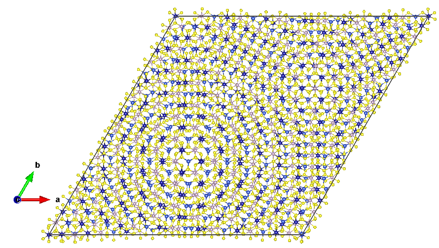
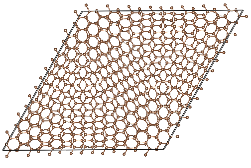

# Commensurate Twisted Bilayer Builder

`build_twisted_bilayer.py` creates a periodic twisted bilayer POSCAR from a
single-layer hexagonal POSCAR. All elements and atomic positions are copied, so
it works for multi-element layers such as CuCrP2S6 as well as graphene.

## Requirements

```bash
pip install pymatgen numpy
```

The input must contain one isolated layer with a hexagonal in-plane primitive
lattice (`a = b`, with a 60 or 120 degree in-plane angle). A vacuum region is
required in the input POSCAR. The script preserves all atoms within the layer.

## Usage

```bash
python build_twisted_bilayer.py INPUT_POSCAR -m M -n N [options]
```

`M` and `N` are positive integers with `M > N`. The twist angle is

```text
theta = acos[(M^2 + 4MN + N^2) / (2(M^2 + MN + N^2))]
```

Useful choices are `(M, N) = (2, 1)` for 21.79 degrees and `(3, 2)` for
13.17 degrees.

## Example: CuCrP2S6

```bash
python build_twisted_bilayer.py POSCAR_CuCrP2S6 \
  -m 3 -n 2 \
  --distance 6.8 --vacuum 28 \
  --shift 0.333333 0.333333 \
  -o POSCAR_tCuCrP2S6
```

`--distance` is the distance (angstrom) between the mean planes of the two
layers. `--vacuum` is the total cell height. `--shift U V` translates the top
layer by `U*a1 + V*a2` after rotation; start with `0 0` when no preferred
stacking is known.

The output contains `2 * Natoms * (M^2 + MN + N^2)` atoms. Relax the final
structure with a dispersion-inclusive method before calculating properties.



